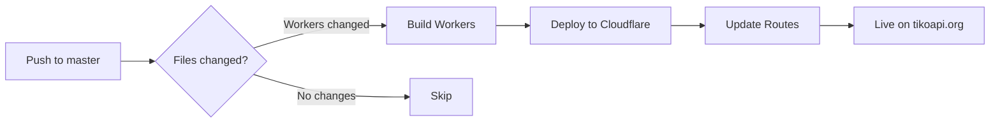

# GitHub Actions Deployment Setup

This guide explains how to set up automatic deployment of Cloudflare Workers via GitHub Actions.

## Setup Process

### 1. GitHub Secret Setup

You only need ONE secret in GitHub:

1. Go to your GitHub repository → **Settings** → **Secrets and variables** → **Actions**
2. Click **New repository secret**
3. Add this secret:
   - Name: `CLOUDFLARE_API_TOKEN`
   - Value: Your Cloudflare API token ([Create here](https://dash.cloudflare.com/profile/api-tokens))
     - Use template: "Edit Cloudflare Workers"
     - Account permissions: `Cloudflare Workers:Edit`
     - Zone permissions: None needed

### 2. Cloudflare Worker Secrets Setup (One-time)

Worker secrets need to be set directly in Cloudflare. You can do this via:

**Option A: Using wrangler CLI (recommended)**
```bash
# Login to Cloudflare
npx wrangler login

# Set secrets for i18n-translator
cd workers/i18n-translator
npx wrangler secret put OPENAI_API_KEY --env production
npx wrangler secret put SUPABASE_URL --env production
npx wrangler secret put SUPABASE_SERVICE_KEY --env production

# Set secrets for media-upload
cd ../media-upload
npx wrangler secret put OPENAI_API_KEY --env production

# Set secrets for sentence-engine
cd ../sentence-engine
npx wrangler secret put OPENAI_API_KEY --env production
npx wrangler secret put SUPABASE_URL --env production
npx wrangler secret put SUPABASE_SERVICE_KEY --env production
```

**Option B: Via Cloudflare Dashboard**
1. Go to [Cloudflare Dashboard](https://dash.cloudflare.com) → Workers & Pages
2. Select each worker
3. Go to Settings → Variables
4. Add the required secrets

### 3. Required Secrets per Worker

| Worker | Required Secrets |
|--------|-----------------|
| i18n-translator | `OPENAI_API_KEY`<br>`SUPABASE_URL`<br>`SUPABASE_SERVICE_KEY` |
| media-upload | `OPENAI_API_KEY` |
| sentence-engine | `OPENAI_API_KEY`<br>`SUPABASE_URL`<br>`SUPABASE_SERVICE_KEY` |

## How It Works

1. **Automatic Trigger**: When you push to the `master` branch, the workflow automatically runs
2. **Smart Detection**: Only workers with changes are deployed (unless you use `[build-all]` in commit message)
3. **Deployment**: Each worker is built and deployed to Cloudflare with its secrets

## Deployment Process



## Testing Deployment

After pushing to master, you can:

1. **Check GitHub Actions**:
   - Go to **Actions** tab in your repository
   - Click on the latest workflow run
   - Check for green checkmarks

2. **Test the Workers**:
   ```bash
   # Test i18n-translator
   curl -X POST https://tikoapi.org/translate \
     -H "Content-Type: application/json" \
     -d '{"key":"test.hello","englishTranslation":"Hello","languages":["es","fr"]}'

   # Test sentence-engine
   curl "https://tikoapi.org/sentence/predict?lang=en"

   # Test media-upload health
   curl https://media.tikocdn.org/
   ```

## Commit Message Triggers

Special keywords in commit messages:

- `[build-all]` - Forces all workers to deploy
- `[skip-ci]` - Skips all deployments
- `[build-i18n]` - Forces i18n-translator to deploy
- `[build-media]` - Forces media-upload to deploy  
- `[build-sentence]` - Forces sentence-engine to deploy

Example:
```bash
git commit -m "fix: update worker logic [build-all]"
```

## Troubleshooting

### Deployment Failed?

1. **Check Secrets**: Ensure all secrets are properly set in GitHub
2. **Check Logs**: Click on the failed job in Actions to see error details
3. **Verify Routes**: Ensure domains are added to your Cloudflare account

### Common Issues

| Error | Solution |
|-------|----------|
| "Authentication error" | Check `CLOUDFLARE_API_TOKEN` is valid |
| "Account ID mismatch" | Account ID is hardcoded correctly |
| "Secret not found" | Add missing secret in GitHub settings |
| "Route already exists" | Remove duplicate route in Cloudflare dashboard |

## Manual Override

If you need to deploy manually from your local machine:

```bash
# DO NOT commit these to git!
export CLOUDFLARE_API_TOKEN="your-token"
cd workers/[worker-name]
npx wrangler deploy --env production
```

## Security Notes

- ⚠️ **NEVER** commit secrets to the repository
- ⚠️ **NEVER** log secret values in GitHub Actions
- ✅ Secrets are encrypted in GitHub
- ✅ Secrets are only exposed to the workflow during runtime
- ✅ Use service role keys with minimal permissions

## Monitoring Deployments

1. **GitHub Actions**: Check workflow runs in the Actions tab
2. **Cloudflare Dashboard**: View worker analytics and logs
3. **Email Notifications**: Enable GitHub notifications for failed workflows

## Cost Considerations

- GitHub Actions: Free for public repos, 2,000 minutes/month for private
- Cloudflare Workers: 100,000 requests/day free tier
- Monitor usage in both dashboards to avoid unexpected charges